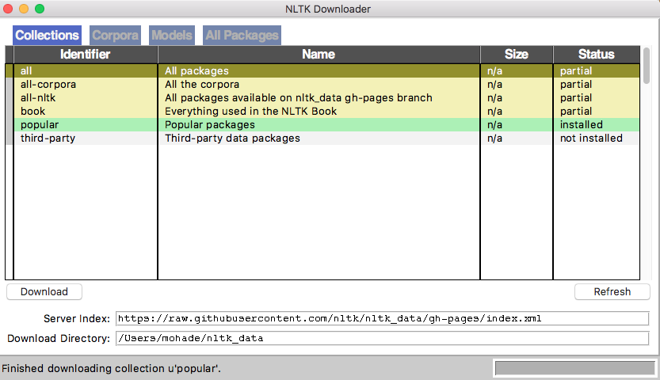
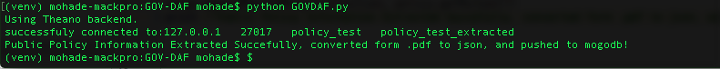
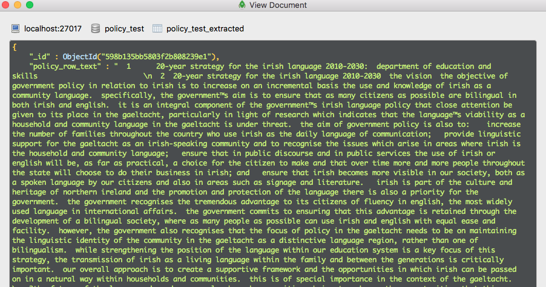
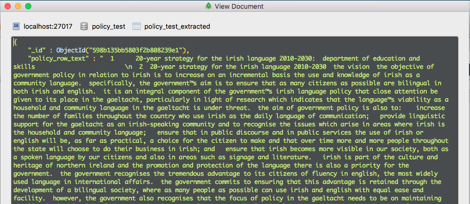
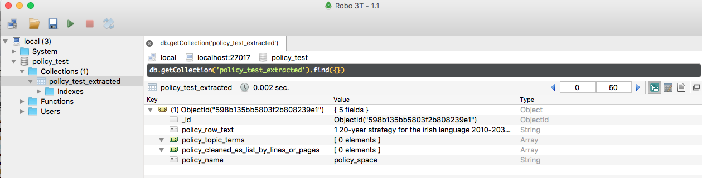
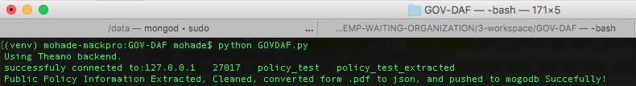
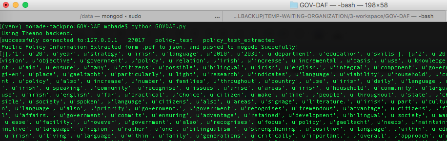
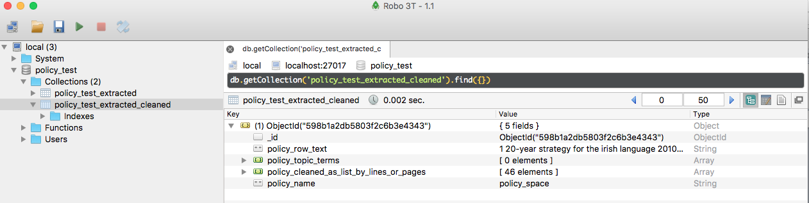
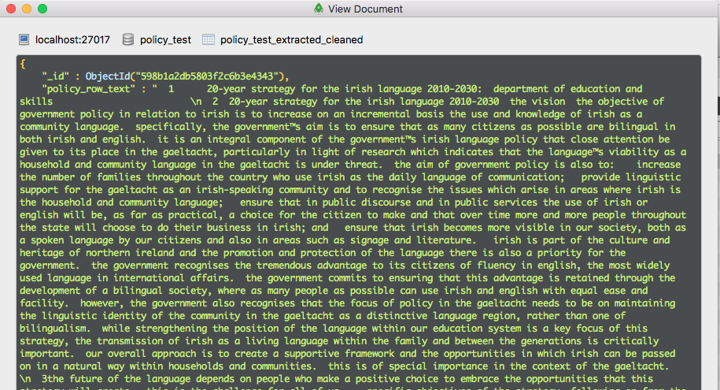
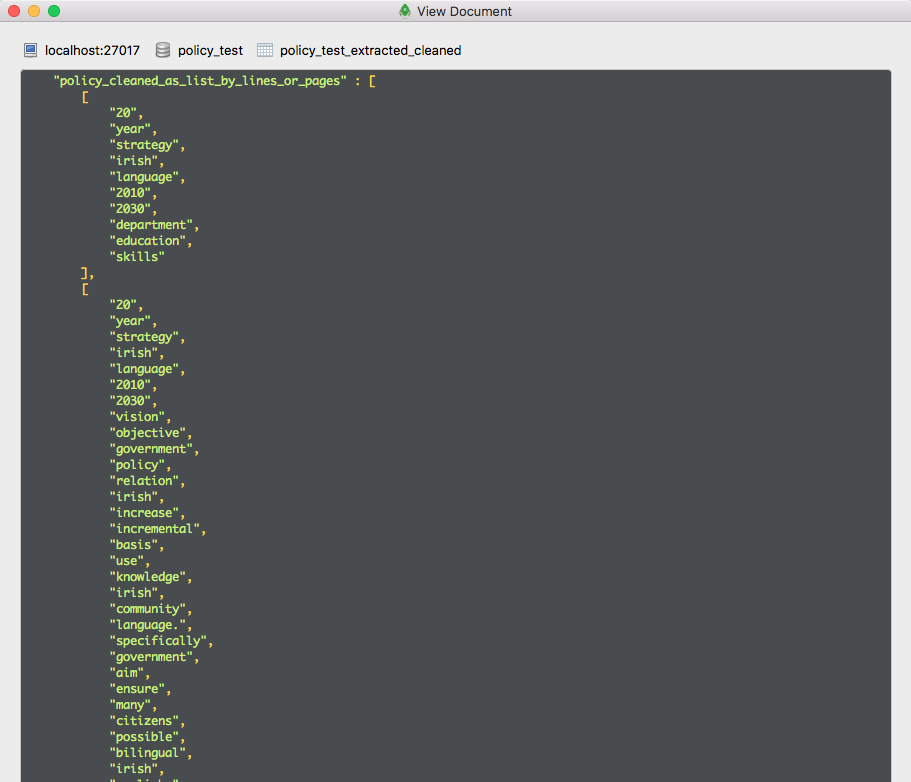

GOV-DAF
=========

Government Satisfaction Analysis Framework
*initial commits (work on progress)

mongodb installation [one time only]
--------------------
[1] https://docs.mongodb.com/master/administration/install-community/

[2] https://robomongo.org/download [optional]

Gov-DAF installation [one time only]
--------------------
$ virtualenv venv

$ source venv/bin/activate

$ pip install -r requirements.txt

NLTK installation [one time only]
--------------------
 http://www.nltk.org/data.html

[OR]

$ source venv/bin/activate

$ python

$ import nltk

$ nltk.download()

then choose "popular packages" from the list.

Run Gov-Daf
------------

[1] run mongo

$ sudo mongod

[2] append tweet repository to mongodb

[3] set Gov-DAF arguments

[4] run Gov-DAF

[5] print reports

screen samples
--------------------

