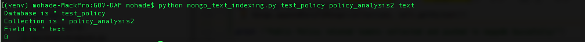

GOV-DAF
=========

Government Satisfaction Analysis Framework  [Part of Masters Thesis awarded from Alexandria University, Egypt]

Publication:

[1] http://dl.acm.org/citation.cfm?id=2910093

[2] in press

[3] in press

[4] Masters Thesis under review (August 2017)

mongodb installation [one time only]
--------------------
[1] https://docs.mongodb.com/master/administration/install-community/

[2] https://robomongo.org/download [optional]

[3] text indexing (mongo 3.x)

$python mongo_text_indexing.py -h
$python mongo_text_indexing.py -db tweet_db -col tweet_collection -field field_name

Gov-DAF installation [one time only]
--------------------
$ virtualenv venv

$ source venv/bin/activate

$ pip install -r requirements.txt

GOVDAF configuration
--------------------
tweeter_config.py [setting twitter API access credinalities]

mongo_config.py [setting mongodb host and port]

NLTK installation [one time only]
--------------------
 http://www.nltk.org/data.html

[OR]

$ source venv/bin/activate

$ python

$ import nltk

$ nltk.download()

then choose "popular packages" from the list.

Run Gov-Daf
------------

[1] run mongo

$ sudo mongod

[2] append tweet repository to mongodb

[3] set Gov-DAF arguments

[4] run Gov-DAF

$ python GOVDAF.py

[5] print reports

screen samples
--------------------

Last Update:
------------
19 August 2017

*initial commits (work on progress)
